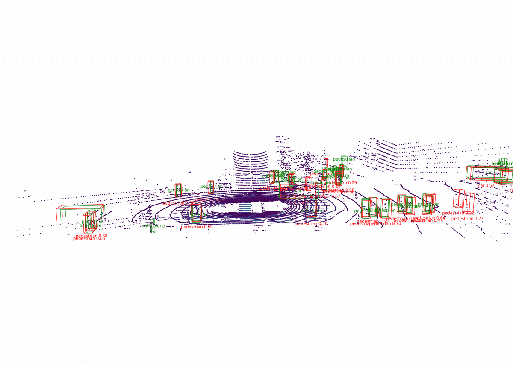

# bev-perception-nuscenes




## config folder

1. Find the right config folder
2. Pinpoint the right config file you want to use
3. From the README locate the right pytorch checkpoint and download locally


## Print function help

```bash
PYTHONPATH="./mmdetection3d/" \
    python mmdetection3d/tools/create_data.py --help
```


## Create the `.pkl` info files

```bash
time PYTHONPATH="./mmdetection3d/" \
    python mmdetection3d/tools/create_data.py nuscenes \
    --root-path ./data/nuscenes \
    --out-dir ./data/nuscenes \
    --extra-tag nuscenes \
    --version v1.0-mini 2>&1 | tee create_data.log
```


## Run inference on mini data

```bash
time PYTHONPATH="./mmdetection3d/" \
    python mmdetection3d/tools/test.py \
    mmdetection3d/configs/centerpoint/centerpoint_pillar02_second_secfpn_head-circlenms_8xb4-cyclic-20e_nus-3d.py \
    checkpoints/centerpoint_02pillar_second_secfpn_circlenms_4x8_cyclic_20e_nus_20220811_031844-191a3822.pth \
    --work-dir results/centerpoint_pillar \
    --cfg-options test_dataloader.dataset.metainfo.version=v1.0-mini \
    test_evaluator.jsonfile_prefix=results/centerpoint_pillar/preds 2>&1 | tee test.log
    # test_dataloader.dataset.data_root=data/nuscenes/
```


## Run inference on trainval data - BEVFusion

- **Compile BEVFusion's custom CUDA ops**

```bash
export TORCH_CUDA_ARCH_LIST="8.9"
python projects/BEVFusion/setup.py develop
```

- **Check**

```bash
find projects/BEVFusion -name "*.so"
```


```bash
time PYTHONPATH="./mmdetection3d/" python \
    mmdetection3d/tools/test.py mmdetection3d/projects/BEVFusion/configs/bevfusion_lidar_voxel0075_second_secfpn_8xb4-cyclic-20e_nus-3d.py \
    checkpoints/bevfusion_lidar_voxel0075_second_secfpn_8xb4-cyclic-20e_nus-3d-2628f933.pth \
    --work-dir results/bevfusion_lidar \
    --cfg-options \
    test_evaluator.jsonfile_prefix=results/bevfusion_lidar/preds \
    test_dataloader.batch_size=1
    # test_dataloader.dataset.indices=50
    
```


**centerpoint_voxel**

```bash
PYTHONPATH="./mmdetection3d/"  python mmdetection3d/tools/test.py  mmdetection3d/configs/centerpoint/centerpoint_voxel01_second_secfpn_head-circlenms_8xb4-cyclic-20e_nus-3d.py checkpoints/centerpoint_01voxel_second_secfpn_circlenms_4x8_cyclic_20e_nus_20220810_030004-9061688e.pth --work-dir results/centerpoint_voxel --cfg-options test_dataloader.dataset.metainfo.version=v1.0-mini test_evaluator.jsonfile_prefix=results/centerpoint_voxel/preds
```


**pointpillar_secfpn**

```bash
PYTHONPATH="./mmdetection3d/"  python mmdetection3d/tools/test.py  mmdetection3d/configs/pointpillars/pointpillars_hv_secfpn_sbn-all_8xb4-2x_nus-3d.py checkpoints/hv_pointpillars_secfpn_sbn-all_4x8_2x_nus-3d_20210826_225857-f19d00a3.pth --work-dir results/pointpillars_secfpn --cfg-options test_dataloader.dataset.metainfo.version=v1.0-mini test_evaluator.jsonfile_prefix=results/pointpillars_secfpn/preds
```


### What does test.py do?

1. Creates the model architecture (`nn.Module`) using pytorch

2. Loads the checkpoint (`.pth` file) and and copies the weights into the model via `load_State_dict`

3. `test_dataloader` reads `nuscenes_infos_val.pkl` and for each of the ~81 mini-val keyframes accumulates the 10 sweeps, in LiDAR frame &rarr; voxelization/formatting transforms &rarr; batched into a tensor

4. **Forward pass**: per batch (= 1 for inference). `model.test_step()` runs: pillar feature encoding → scatter to BEV → SECOND backbone → SECONDFPN neck → CenterHead → and crucially the **post-processing** (score threshold, and here **CircleNMS**) that turns raw heatmap/regression outputs into a final list of predicted 3D boxes with scores and labels.

5. **Evaluation Metrics**: matching predictions to GT by center distance at thresholds {0.5, 1, 2, 4}m, computing per-class AP, the five TP errors (mATE/mASE/mAOE/mAVE/mAAE), and combining into **mAP** and **NDS**.


# Evaluation metrics

$precision = \dfrac{TP}{TP + FP}$

$recall = \dfrac{TP}{TP + FN}$

## mAP

1. per center-distance **AUC**: For a single `class`, at a single `center distance threshold`, change the `detection_score`:
    - Get the **precision-recall** curve (what counts as a TP)
    - Calculate the area under the curve (**AUC**)
      
2. per class **AP**: For a single `class`, change the `center distance threshold`:
    - 4 thresholds {0.5, 1, 2, 4}m (what counts as a TP)
    - average the AUC over these 4 thresholds to get the **AP** per class

3. **mAP**
    - average the **AP**s over the 10 classes in nuScenes dataset to get the **mAP**


- nuScenes matches predictions to GT by **center distance**, not **IoU**. That means a box can count as a true positive while being wrong about its **size**, **orientation**, or **velocity** — as long as its center is close enough, it matches. So mAP, built on that matching, is largely blind to how well you got the other box attributes right. **NDS** exists to address this.

- **IoU Advantages**: IoU is computed from the full 3D box overlap, so it inherently couples center, size, and orientation into one number. A prediction with the right center but wrong dimensions or heading gets a lower IoU — so IoU-based matching wouldn't let a badly-shaped box count as a clean TP the way center-distance does.

- **IoU Disadvantages**: IoU is harsh and unstable for small/distant objects. IoU is a ratio, so for small objects (pedestrians, bicycles, traffic cones) a tiny absolute localization error produces a huge relative overlap drop — a box off by half a meter might have decent center-distance but near-zero IoU. 


## NDS (nuScenes Detection Scores)


- **Five True Positive (TP) errors** — for the boxes that *did* match, how wrong were the attributes. Each is a mean error over TPs, averaged across classes (m):

    - **mATE** — Average Translation Error (center offset, meters)
    - **mASE** — Average Scale Error (1 − IoU after aligning center & orientation, so pure size mismatch)
    - **mAOE** — Average Orientation Error (heading, radians)
    - **mAVE** — Average Velocity Error (m/s) — nuScenes-specific, this is why the nuScenes head regresses per-object velocity (vx, vy)
    - **mAAE** — Average Attribute Error (1 − attribute classification accuracy, e.g. moving vs. parked)

<br>

- [x] **TP errors** are computed at a single matching threshold: the **2 m center-distance**.

**Combining them:** NDS is a weighted sum — mAP gets half the weight, the five errors together the other half. The rough form:

$NDS = \dfrac{1}{5 · mAP + Σ (1 − min(1, mTPError)) }$


> - So mAP contributes 5 parts, and each of the 5 TP errors contributes one part
> - mTPErrors converted from an error into a score via 1 − error
> - The score is clipped to [0, 1] so a large error returns a score of 0 rather than going negative
> - Higher NDS = better, in [0, 1].


# Results

| Model                      | Modality     | Transformer | mAP (mini)   | NDS (mini)   | mAP (trainval) | NDS (trainval) |
|----------------------------|--------------|-------------|--------------|--------------|----------------|----------------|
| Pointpillar_fpn            |  LiDAR       |  No         |    0.38      |    0.45      |     0.39       |       0.53     |
| Pointpillar_secfpn         |  LiDAR       |  No         |    0.33      |    0.41      |     0.34       |       0.49     |
| centerpoint_pillar         |  LiDAR       |  No         |    0.41      |    0.48      |     0.48       |       0.59     |
| centerpoint_01voxel        |  LiDAR       |  No         |              |              |     0.55       |       0.64     |
| centerpoint_0075voxel      |  LiDAR       |  No         |              |              |     0.56       |       0.65     |
| BEVFusion*                 |  LiDAR       |  Yes*       |              |              |     0.64       |       0.69     |
| BEVFusion*                 |  LiDAR + CAM |  Yes*       |              |              |     0.68       |       0.71     |
| PETR                       |  CAM         |  Yes        |              |              |     0.38       |       0.39     |


\* BEVFusion uses a TransFusion-style transformer detection head. So the head is transformer-based, but its backbone/fusion isn't a transformer per se.


# Milestone 5


## How the models are scored

Every model in this project is evaluated with the official nuScenes detection protocol, over the 10 detection classes on the `v1.0-trainval` validation split. Two things about that protocol shape how the results below should be read, and both differ from the KITTI/COCO conventions people usually carry into 3D detection.

**Matching is by center distance, not IoU.** A prediction counts as a true positive if its bird's-eye-view center lands within a distance threshold of an unmatched ground-truth box of the same class — matched greedily in descending confidence order, so a second box on an already-detected object becomes a false positive rather than a second hit. nuScenes uses this instead of 3D IoU deliberately: IoU is unforgiving for the small, sparse-return objects that dominate the long tail (pedestrians, cones, bicycles), where a few centimeters of extent error can zero out the overlap even when the object is, for all practical purposes, correctly localized. Center distance decouples *"did we find it and place it?"* from *"did we size it perfectly?"* — and nuScenes then scores those two questions separately.

**mAP measures detection; the TP errors measure quality; NDS combines them.** Average Precision is computed at four center-distance thresholds (0.5, 1, 2, 4 m) and averaged across thresholds and classes to give mAP — so mAP answers *how much did we detect, across a sweep from strict to lenient localization*. Localization quality is then reported by five true-positive error terms, each averaged only over matched detections at the single 2 m threshold: translation (mATE), scale (mASE), orientation (mAOE), velocity (mAVE), and attribute (mAAE). The headline nuScenes Detection Score folds both halves into one number,

$$\text{NDS} = \tfrac{1}{10}\Big[\,5\cdot\text{mAP} + \sum_{\text{5 TP errors}}\big(1 - \min(1,\,\text{error})\big)\Big],$$

weighting detection at half and the five quality terms at half. Because the two halves move independently, a model can win on mAP while losing on orientation error — which is exactly the kind of trade this project's comparison table is built to surface.

**Not every error is defined for every class.** Traffic cones and barriers are geometrically or semantically incapable of carrying certain targets — a cone has no meaningful heading, velocity, or attribute — so nuScenes leaves those error terms undefined for those classes rather than scoring them as zero. In the per-class tables these appear as blanks, and the aggregate errors are averaged only over the classes for which each error is defined (orientation over 8 classes, velocity and attribute over the movable subset). This is worth stating explicitly because a missing cell here means *"not applicable,"* not *"not measured"* — reading it as a perfect score would quietly distort any per-class comparison.


## Headline table


| Model                 |   mAP↑ |   NDS↑ |   mATE↓ |   mASE↓ |   mAOE↓ |   mAVE↓ |   mAAE↓ |
|-----------------------|--------|--------|---------|---------|---------|---------|---------|
| bevfusion_lidar       |   0.64 |   0.69 |    0.28 |    0.25 |    0.3  |    0.28 |    0.19 |
| bevfusion_lidar_cam   |   0.68 |   0.71 |    0.28 |    0.25 |    0.3  |    0.28 |    0.19 |
| centerpoint_0075voxel |   0.56 |   0.65 |    0.3  |    0.25 |    0.31 |    0.29 |    0.18 |
| centerpoint_01voxel   |   0.55 |   0.64 |    0.3  |    0.25 |    0.31 |    0.3  |    0.2  |
| centerpointpillars    |   0.48 |   0.59 |    0.33 |    0.26 |    0.37 |    0.35 |    0.2  |
| petr                  |   0.38 |   0.39 |    0.74 |    0.71 |    0.48 |    0.87 |    0.2  |
| pointpillars_fpn      |   0.39 |   0.53 |    0.42 |    0.28 |    0.49 |    0.3  |    0.19 |
| pointpillars_secfpn   |   0.34 |   0.49 |    0.43 |    0.28 |    0.53 |    0.39 |    0.2  |


# Binning

- Predictions act in descending score order; each prediction, on its turn, claims the closest unclaimed same-class GT within 2 m.


# Clear Day VS Night & Rain 

- Conditional robustness (day/night, clear/rain). A naive comparison suggested night improved recall — an artifact of composition, since nuScenes night scenes skew closer-range and car-heavy and omit several hard classes entirely. Controlling for this by comparing AP only on matched (class, range) cells removes the illusion, but nuScenes val contains too few night/rain scenes to estimate per-class adverse-condition AP reliably: the classes where a lighting or weather effect would appear (pedestrian, bicycle, cone at night) have fewer than ~65 ground-truth boxes per condition. On the well-sampled classes (car, and rain's larger samples) detection is essentially condition-stable. A robust day/night and clear/rain comparison is a natural extension given a night/rain-enriched split or the full test set.


# 5.3

## Where fusion helps: decomposing the +0.04 mAP

The two BEVFusion configurations share an identical LiDAR backbone, BEV neck, and detection head; the camera branch (image backbone, depth-based view transform, and BEV fuser) is the only difference between them. The full-model gap of roughly +0.04 mAP is therefore attributable to fusion alone, which makes a per-class and per-range breakdown of that delta a clean ablation rather than a confounded comparison. The table below reports per-class camera gain — lidar-camera AP minus lidar-only AP, averaged across range bins — sorted by magnitude.

| Class | Camera gain (ΔAP) |
|---|---|
| motorcycle | +0.086 |
| bicycle | +0.075 |
| traffic_cone | +0.062 |
| trailer | +0.043 |
| truck | +0.037 |
| construction_vehicle | +0.035 |
| car | +0.033 |
| bus | +0.033 |
| barrier | +0.022 |
| pedestrian | +0.019 |

The top of the ranking confirms the intuition that fusion pays off most on small, visually distinctive, LiDAR-sparse objects: the two-wheelers (motorcycle +0.086, bicycle +0.075) and traffic cones (+0.062) gain two to four times what the rigid vehicle classes do. These are exactly the objects whose thin, ambiguous point-cloud signatures leave the most headroom for appearance cues to disambiguate.

The surprise is at the bottom. Pedestrian (+0.019) and barrier (+0.022) were expected to be among the largest beneficiaries — pedestrians are small and appearance-rich — yet they gain the least of any class. The most plausible reading is that the organizing principle is not object size but *LiDAR headroom*: the LiDAR-only model already detects pedestrians and barriers well (both exceed 0.88 and 0.69 AP in clear conditions), so there is little left for the camera to recover, whereas two-wheelers remain genuinely LiDAR-ambiguous and benefit disproportionately. Notably, the camera also does not simply saturate on the "easy" LiDAR classes — car and bus still gain a steady ~0.033 — so the effect is a broad ~0.03 lift across all classes with a two-wheeler and traffic-cone premium on top, rather than the sharp small-versus-large split the naive hypothesis predicted.

The range decomposition is cleaner and monotonic. Averaging the camera gain across classes within each ego-distance bin:

| Range | Camera gain (ΔAP) |
|---|---|
| 0–20 m | +0.014 |
| 20–30 m | +0.041 |
| 30–40 m | +0.062 |
| 40–50 m | +0.076 |

The camera earns almost nothing up close, where LiDAR returns are dense and geometry is already unambiguous, and progressively more with distance, reaching its largest contribution in the farthest bin — a five-fold increase from the nearest range to the farthest. This is the expected behaviour and the strongest single result of the decomposition: fusion's value concentrates precisely where LiDAR degrades, at range.

Two caveats on interpretation. The per-class figures are averaged over range bins with equal weight, so they capture the direction and ranking of the effect rather than an exact contribution to overall mAP, which would require weighting by object counts; the sorted ranking is robust to this choice. And the far-bin gains are computed over the classes that survive the per-class range cap, so the 40–50 m figure averages a smaller class set than the near bins — the monotonic trend is real, but the exact 40–50 m value should be read as directional.


# 5.5 Failure Analysis

- surface rare class misses. Because rare classes are more expensive for mAP (averaged over all classes, thus individual rare class misses have larger effect on mAP)


## Barriers dominating the failures

- fn_barrier_365b20cf.png

- fn_barrier_a6311cc7.png

The residual is dominated by barriers (12 of 18 under the weighted ranking; 221 of 223 under raw FN-count ranking), and inspection shows this concentration reflects the construction-zone annotation regime rather than a distinct perception deficit. Beyond the segment-granularity effect described above, many residual barrier false negatives involve a second confound: in these scenes, "barrier" annotations frequently cover objects that are visually and structurally cone-like — striped sawhorses, delineator posts, and drum arrangements sharing the same orange-and-white traffic livery — and are often immediately adjacent to, or partially composed of, objects independently annotated as traffic cones. The fusion model responds by producing dense `traffic_cone` detections throughout these regions (visible as cone-sized predictions surrounding the missed barrier boxes in Figs. [N], [N+1]), which the class-exclusive matcher cannot credit toward barrier recall. The barrier/cone boundary in construction zones is thus a labeling-taxonomy gray area analogous to the car/truck boundary identified earlier: both classes denote traffic-channeling objects with shared appearance, and the residual false negatives concentrate precisely where the distinction is least visually grounded. We therefore attribute the bulk of the barrier residual to this taxonomy ambiguity combined with segment granularity, rather than to a failure of either sensing modality — consistent with these objects being close-range (11–30 m) and fully visible (v80-100) in nearly all residual cases.

---


Here's a README-ready section — markdown, figure paths matching your filenames, and only claims the three printouts and checks actually support:

---

### Instance-level failure analysis (BEVFusion LiDAR–camera fusion)

Mining the validation split for the samples where the fusion model accumulates the most false negatives, then mechanically attributing them to occlusion, range, and class rarity, left a small residual of unexplained cases: close-range, mostly-visible, common-class objects. Inspecting these individually surfaced three distinct mechanisms, one per figure below. Notably, only one of the three is a perception failure in the ordinary sense.

**1. Annotation-boundary noise masquerading as a false negative** (`fn_car_015aab3e.png`)

A parked pickup truck, fully visible at 13 m, is annotated as `car`. The fusion model detects it as `truck` with confidence 0.73 and a center error of 0.09 m — an essentially perfect detection. Because nuScenes matching is class-exclusive, this single object registers as both a car false negative and a truck false positive. The nuScenes taxonomy assigns pickups to the truck class, so the model's output is arguably more consistent with the labeling guidelines than the annotation itself. Instance-level inspection surfaces label noise that aggregate AP silently absorbs into per-class scores.

**2. Genuine class confusion under partial occlusion** (`fn_truck_b2429da0.png`)

A truck parked in a dense row at 28 m, partially screened by neighboring vehicles (visibility 60–80%), is detected only as a low-confidence `car` (score 0.10, 0.67 m from the GT center), while the flanking vehicles are confidently detected. Unlike the pickup case, this is a real model limitation: the visible fragment — a cab profile among car profiles, backed by sparse and structureless LiDAR returns — sits in exactly the appearance regime where the car/truck decision is hard. The same mechanical signature (a cross-class prediction within the match radius) thus spans two different root causes, separable by prediction confidence: high-confidence cross-class detections indicate annotation-boundary noise; low-confidence ones indicate genuine ambiguity.

**3. Mutual occlusion starving both modalities** (`fn_truck_7af66839.png`)

A truck in a packed parking row at 32 m is missed outright: the nearest truck prediction belongs to the neighboring vehicle (verified via the prediction–GT association), and no prediction of any class corresponds to this object. The BEV view shows why — the ground-truth footprint contains a single LiDAR point, and the camera sees only a fragment between neighbors. This case marks the boundary of the fusion mechanism highlighted in the recovery analysis: camera evidence can compensate for LiDAR sparsity only when the camera has line of sight. Under mutual occlusion, both modalities are suppressed simultaneously and the redundancy argument for fusion breaks down.

Together the three cases refine the aggregate picture: a portion of residual close-range false negatives reflects taxonomy ambiguity and label noise rather than detection failure, while the genuine misses concentrate where moderate occlusion and moderate range compound — each below the threshold that would flag it individually, but jointly sufficient to defeat both sensors.

---

Two integrity notes before you commit it. First, case 3's closing claim in the section is deliberately written without asserting what the lidar-only model did — if you run the one-row check and it also missed (expected), you can strengthen that paragraph with "the LiDAR-only model also misses this object; the camera stream adds nothing under mutual occlusion." Don't add it unverified. Second, the intro says "mechanically attributing... left a small residual" — if the README shows this section but not the mining pipeline, consider one sentence pointing at `scripts/mine_failures.py` and the dumped CSV, so a reviewer can see the residual wasn't hand-picked. That provenance line is cheap and it's the difference between "curated anecdotes" and "audited pipeline output" — the impression you want a hiring reviewer to leave with.


