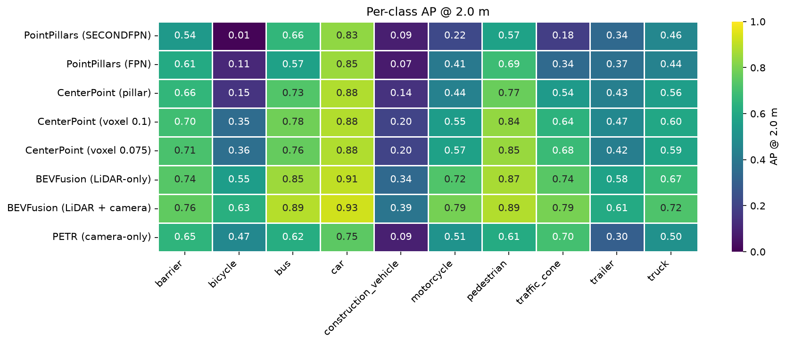
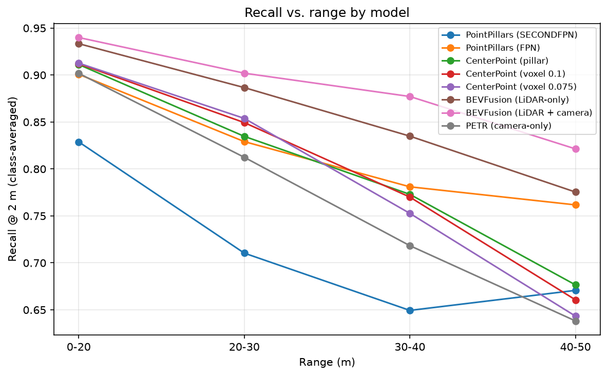
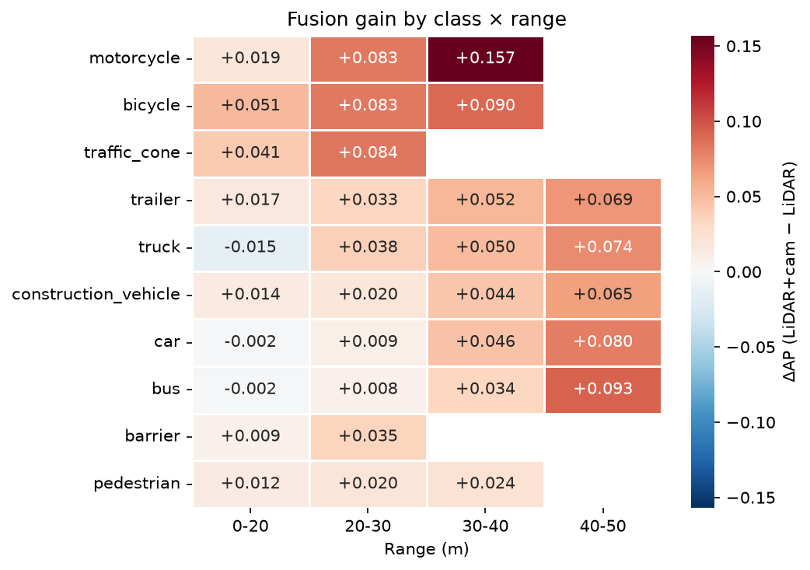
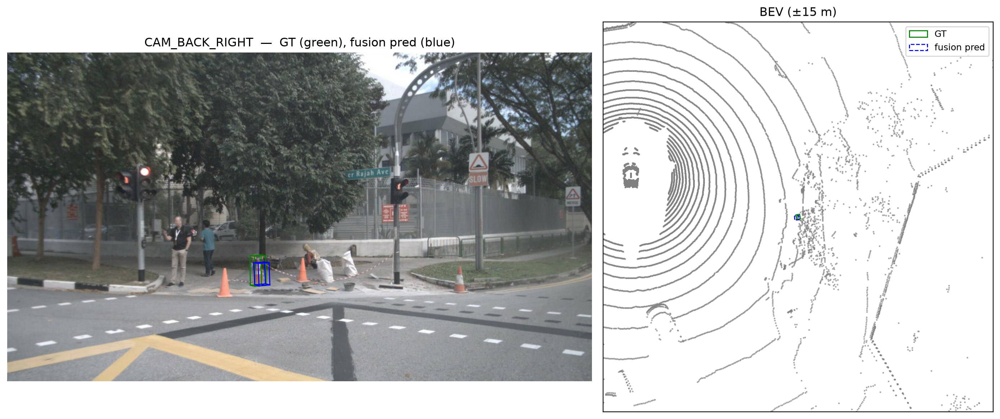
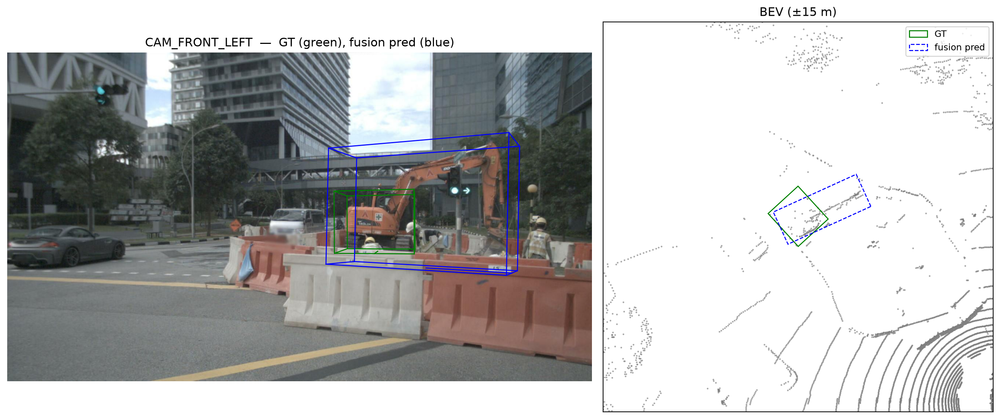
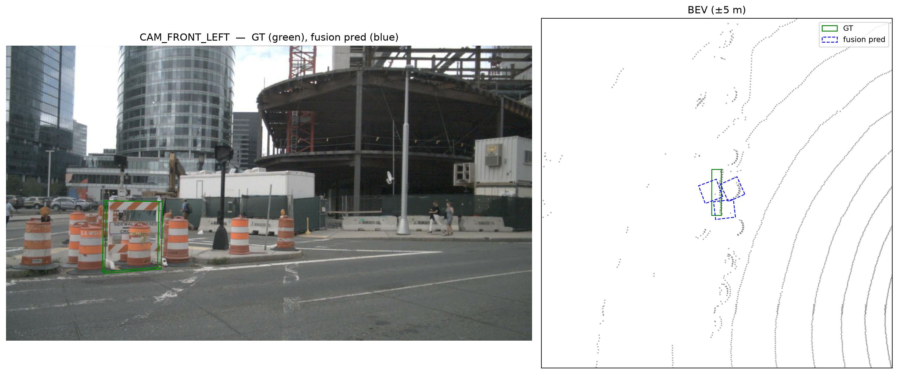
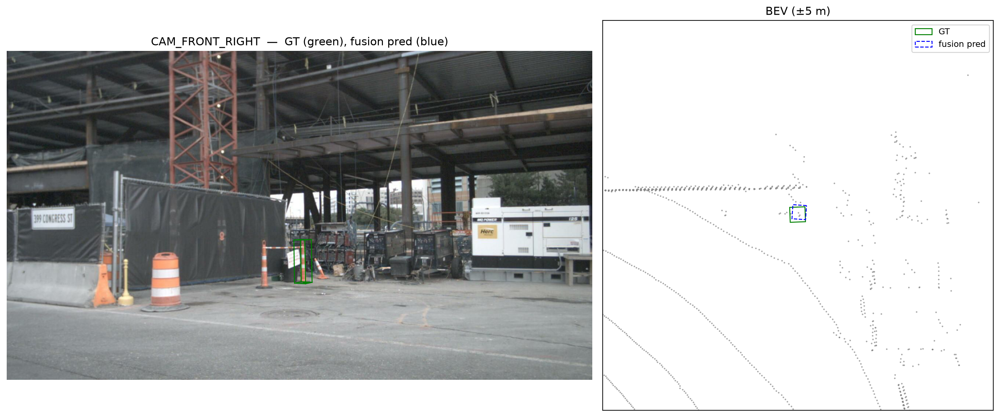
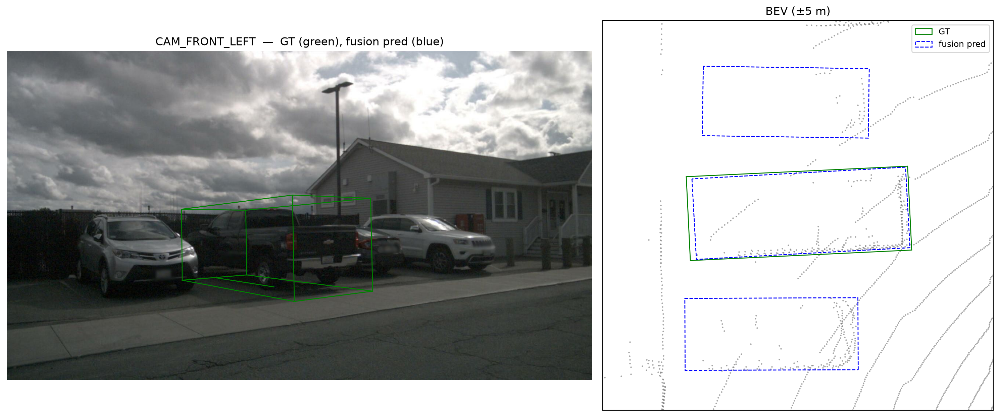
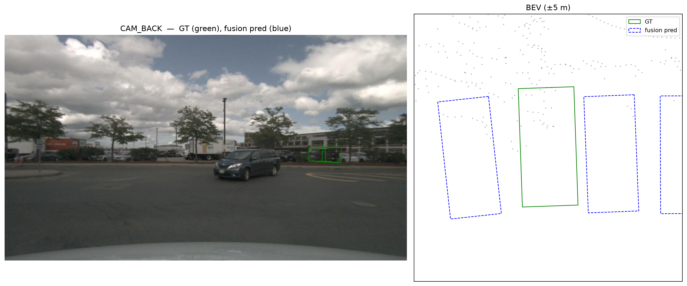
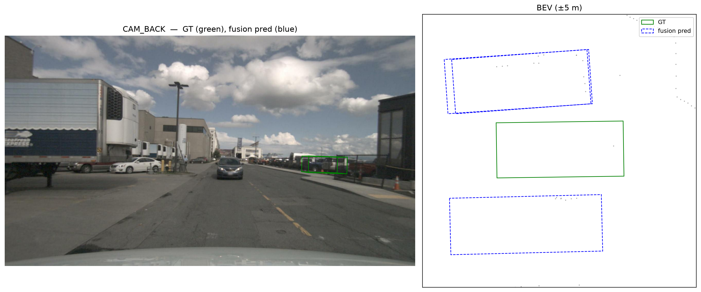

# BEV 3D Object Detection on nuScenes: LiDAR, Camera, and Fusion

A benchmark and analysis of eight 3D object detection models on the nuScenes validation split, spanning three sensor paradigms: LiDAR-only, camera-only, and LiDAR–camera fusion. Beyond aggregate metrics, results are decomposed to per-class and per-range level and verified at instance level — including a recovery analysis of where camera evidence rescues LiDAR sparsity, and a failure-mining pass showing that a substantial share of the fusion model's residual close-range false negatives are evaluation and taxonomy artifacts (label noise, class-boundary ambiguity, annotation granularity) rather than perception failures.


---

## Results

All models are evaluated on the nuScenes v1.0-trainval **validation split** (150 scenes, 6,019 samples) with the official devkit protocol: class-exclusive center-distance matching, AP averaged over 0.5 / 1 / 2 / 4 m thresholds, class-specific range caps, TP errors at the 2 m threshold. All eight are published OpenMMLab checkpoints; none were retrained.

| Model | Modality | mAP ↑ | NDS ↑ | mATE ↓ | mASE ↓ | mAOE ↓ | mAVE ↓ | mAAE ↓ |
|---|---|---|---|---|---|---|---|---|
| BEVFusion (LiDAR + camera)\* | Fusion | **0.68** | **0.71** | 0.28 | 0.25 | 0.30 | 0.28 | 0.19 |
| BEVFusion (LiDAR-only)\* | LiDAR | 0.64 | 0.69 | 0.28 | 0.25 | 0.30 | 0.28 | 0.19 |
| CenterPoint (voxel 0.075) | LiDAR | 0.56 | 0.65 | 0.30 | 0.25 | 0.31 | 0.29 | 0.18 |
| CenterPoint (voxel 0.1) | LiDAR | 0.55 | 0.64 | 0.30 | 0.25 | 0.31 | 0.30 | 0.20 |
| CenterPoint (pillar) | LiDAR | 0.48 | 0.59 | 0.33 | 0.26 | 0.37 | 0.35 | 0.20 |
| PointPillars (FPN) | LiDAR | 0.39 | 0.53 | 0.42 | 0.28 | 0.49 | 0.30 | 0.19 |
| PETR | Camera | 0.38 | 0.39 | 0.74 | 0.71 | 0.48 | 0.87 | 0.20 |
| PointPillars (SECONDFPN) | LiDAR | 0.34 | 0.49 | 0.43 | 0.28 | 0.53 | 0.39 | 0.20 |

\* Both BEVFusion rows share an identical LiDAR backbone, BEV neck, and TransFusion-style transformer detection head; the camera branch is the only difference. This is the controlled fusion ablation the analysis below is built on.

Per-class values behind this table are in [`results/metrics_master.csv`](results/metrics_master.csv) (long format: `model, class, metric, value`).

**Takeaways**

- **Fusion adds +0.04 mAP / +0.02 NDS** over the identical LiDAR-only backbone, with every TP-error term unchanged to two decimals — the camera adds detections, not localization quality (see [Fusion decomposition](#fusion-decomposition)).
- **Voxel beats pillar at matched architecture**: CenterPoint gains +0.07–0.08 mAP moving from pillars to voxels; finer voxels help marginally (0.075 vs 0.1 m: +0.01 mAP).
- **Camera-only trails on NDS far more than mAP** (PETR: 0.38 / 0.39). Monocular depth uncertainty inflates translation (0.74 m) and velocity (0.87 m/s) errors even where detection recall is competitive with older LiDAR models.
- **Architecture generation matters more than modality count**: LiDAR-only BEVFusion beats every non-fusion model by a wide margin.

---

## Analysis

All analysis code is in one notebook, [`notebooks/analysis.ipynb`](notebooks/analysis.ipynb), backed by the evaluation helpers in [`scripts/evaluation/common.py`](scripts/evaluation/common.py). Section numbers below refer to the notebook.

### Per-class and per-range breakdown



Every GT box and prediction is binned by ego distance (0–20 / 20–30 / 30–40 / 40–50 m) and recall and AP are recomputed per (class, bin) with the devkit's own `accumulate`/`calc_ap` on the binned box sets (notebook §3). Recall degrades with range for every model and every class; **the slope is the discriminator**. Rare, large classes (`construction_vehicle`, `trailer`) separate strong from weak LiDAR models; small-object classes (`pedestrian`, `traffic_cone`) track encoder resolution. For LiDAR-only BEVFusion, car recall at the 2 m threshold falls from 0.995 (0–20 m) to 0.906 (40–50 m); class-averaged recall falls from 0.93 to 0.78 (0.94 to 0.82 with the camera).



*Methodological note:* cells where a class has no ground-truth instances in a bin are reported as NaN, not 0.0. The devkit's `npos == 0 → AP = 0` behavior is guarded explicitly to avoid deflating sparse cells.

### Fusion decomposition

The two BEVFusion configurations differ only in the camera branch (image backbone, depth-based view transform, BEV fuser), so the +0.04 mAP gap is attributable to fusion alone and its per-class / per-range decomposition is a clean ablation rather than a confounded comparison (notebook §5).



Blank cells are outside the class's evaluation range cap (30 m for barrier and traffic_cone, 40 m for pedestrian, bicycle and motorcycle, 50 m otherwise). The only negative cell of any size is truck at 0–20 m (−0.015).

**Per class** — ΔAP (LiDAR+camera − LiDAR-only), averaged across range bins:

| Class | ΔAP | | Class | ΔAP |
|---|---|---|---|---|
| motorcycle | +0.086 | | construction_vehicle | +0.035 |
| bicycle | +0.075 | | car | +0.033 |
| traffic_cone | +0.062 | | bus | +0.033 |
| trailer | +0.043 | | barrier | +0.022 |
| truck | +0.037 | | pedestrian | +0.019 |

Fusion pays most on small, visually distinctive, LiDAR-sparse objects: two-wheelers and cones gain two to four times what the rigid vehicle classes do. The surprise is at the bottom. Pedestrian and barrier were expected to be large beneficiaries — small and appearance-rich — yet gain least. The organizing principle is not object size but **LiDAR headroom**: the LiDAR-only model already detects pedestrians and barriers well (AP ≥ 0.88 and ≥ 0.69 respectively), so there is little left to recover, whereas two-wheelers remain genuinely LiDAR-ambiguous. The camera also does not saturate on the "easy" classes — car and bus still gain a steady ~0.03 — so the effect is a broad ~0.03 lift across all classes with a two-wheeler / cone premium on top, not the sharp small-vs-large split the naive hypothesis predicts.

**Per range** — ΔAP averaged across classes within each ego-distance bin:

| Range | ΔAP |
|---|---|
| 0–20 m | +0.014 |
| 20–30 m | +0.041 |
| 30–40 m | +0.062 |
| 40–50 m | +0.076 |

The range decomposition is monotonic and is the strongest single result here: the camera earns almost nothing up close, where LiDAR returns are dense and geometry is unambiguous, and progressively more with distance — a five-fold increase from the nearest bin to the farthest. **Fusion's value concentrates precisely where LiDAR degrades.**

**mAP vs. NDS asymmetry.** The mAP gain (+0.04) exceeds the NDS gain (+0.02) because all five TP-error terms are identical between the two models to two decimals (mATE 0.28, mASE 0.25, mAOE 0.30, mAVE 0.28, mAAE 0.19). The camera adds recall — new detections at range — rather than tightening boxes LiDAR already finds.

*Caveats.* Per-class ΔAP is averaged over range bins with equal weight, so it captures direction and ranking, not exact contribution to overall mAP; the ranking is robust to this choice. The 40–50 m bin averages over the smaller class set that survives the per-class range cap, so its exact value is directional.

### Recovery analysis: when does the camera rescue LiDAR?

**Method.** Ground-truth boxes are labeled TP/FN per model via greedy score-ordered center-distance matching at 2 m, with the prediction–GT association persisted (`ann_token`, matched prediction). Joining both models' GT labels on `ann_token` yields **2,418 nominal FN→TP "recoveries"** (LiDAR-only miss, fusion hit) out of 121,861 GT boxes — car 804, barrier 327, truck 297, traffic_cone 236, pedestrian 234, trailer 132, construction_vehicle 127, bicycle 96, motorcycle 93, bus 72 (notebook §6).

Nominal flips overstate detection recovery: on inspection they include threshold-straddling localization changes and greedy-assignment side effects in crowded scenes, so candidates were rendered and inspected individually rather than counted as recoveries. Representative cases (camera panel with the GT box; BEV crop with GT in green and the matched fusion prediction in blue):

|  |
|---|
| **Genuine recovery.** A traffic cone on a sidewalk work site: the fusion prediction sits on the GT footprint; the LiDAR-only model produced no matching cone. |

|  |
|---|
| **Localization improvement, not a new detection.** An excavator behind a barrier line: the fusion box is larger than the annotation and offset toward the boom, and the flip reflects the 2 m threshold rather than a missed object. Cases like this contribute to AP at the looser thresholds without constituting detection recovery. |

Further rendered recoveries (car, pedestrian, more cones) are in [`results/plots/cam_effect/`](results/plots/cam_effect/).

### Failure analysis: where does fusion still fail?

**Mining.** Samples are ranked by class-rarity-weighted false-negative count — each FN weighted by 1 / (class GT count), aligning the sample ranking with mAP's class balancing so that rare-class misses surface over common-class ones. The 111 FNs of the top-20 samples are then mechanically attributed in order: **occlusion** (annotation visibility ≤ 40 %) → **range** (> 35 m) → **rare class** (the five least frequent classes: trailer, bus, motorcycle, bicycle, construction_vehicle) → **adverse condition** (rain / night scene). The unexplained residual — **18 FNs across 9 samples** — was inspected individually (notebook §7; renders for every mode under [`results/plots/failure/`](results/plots/failure/)).

| Mode | FNs | Composition |
|---|---|---|
| occlusion | 56 | trailer 16 · construction_vehicle 15 · bicycle 10 · motorcycle 6 · barrier 4 · car 4 · truck 1 |
| rare class | 27 | construction_vehicle 13 · bicycle 11 · motorcycle 3 |
| **unexplained** | **18** | **barrier 12 · traffic_cone 3 · truck 2 · car 1** |
| range | 10 | construction_vehicle 5 · motorcycle 2 · truck 2 · trailer 1 |
| adverse condition | 0 | — |

**The dominant "failure" is an annotation artifact.** The residual is dominated by barriers (12 of 18), and the worst samples by raw FN count are construction zones dense with barriers and cones. nuScenes annotates continuous barrier lines as short segments; the detector recovers the line while placing box boundaries offset from the segmentation, producing interleaved TP/FN under center-distance matching. A second confound compounds this: many residual barrier boxes cover objects that are visually cone-like — striped sawhorses, delineator posts, drum arrangements in the same orange-and-white livery — often immediately adjacent to objects independently annotated as `traffic_cone`. The model responds with dense `traffic_cone` detections throughout these regions, which the class-exclusive matcher cannot credit toward barrier recall. The barrier/cone boundary in construction zones is a labeling-taxonomy gray area, and all 12 residual barrier cases are close-range (11–30 m) with visibility 60–100 % — consistent with taxonomy ambiguity plus segment granularity rather than a deficit of either sensing modality. The LiDAR-only model misses 11 of the 12 as well.

|  |  |
|---|---|
| A `barrier` annotation (11.5 m) on a striped sawhorse among drums; the model answers with `traffic_cone` boxes (nearest: score 0.68, 0.18 m), one of which is a TP for a neighboring cone annotation. | A second barrier residual (15.1 m): again the nearest prediction is a `traffic_cone` (score 0.38, 0.09 m) already claimed by an adjacent cone annotation. |

Residual inspection surfaced three further mechanisms, one figure each. Only one of the three is a perception failure in the ordinary sense.

**1. Label noise masquerading as a false negative**



A fully visible pickup truck at 13 m, annotated `car`, is detected as `truck` at confidence 0.73 with 0.09 m center error — an essentially perfect detection. Under class-exclusive matching it registers as both a car FN and a truck FP. The nuScenes taxonomy assigns pickups to `truck`; the model's output is arguably more consistent with the labeling guidelines than the annotation. Instance-level inspection surfaces label noise that aggregate AP silently absorbs into per-class scores.

**2. Genuine class ambiguity under occlusion**



A truck at 32 m in a dense parking row is detected only as a low-confidence `car` (score 0.10, 0.67 m from the GT center) while the flanking vehicles are confidently detected (car scores 0.43–0.46). The LiDAR-only model misses it the same way (car, score 0.15, 0.73 m). This is a real model limitation: a cab profile among car profiles, backed by sparse, structureless LiDAR returns, sits exactly where the car/truck decision is hard. The same mechanical signature as (1) — a cross-class prediction within the match radius — thus spans two root causes, **separable by confidence**: high-confidence cross-class detections indicate annotation-boundary noise; low-confidence ones indicate genuine ambiguity.

**3. Mutual modality starvation**



A truck at 28 m in a packed parking row is missed outright: the nearest prediction of any class above a 0.1 score floor is the neighboring vehicle's (a car, 2.9 m away, matched to its own annotation); the only boxes closer to the GT center are a 0.02-score car and a 0.00-score cone. The ground-truth footprint contains almost no LiDAR returns, and the camera sees only a fragment between neighbors. This marks the boundary of the recovery mechanism above: camera evidence compensates for LiDAR sparsity only given line of sight. Under mutual occlusion both modalities are suppressed together and the redundancy argument for fusion breaks down. The LiDAR-only model also misses this object.

**Net.** Of the 18 residual false negatives, 12 are barrier cases attributable largely to segment granularity and barrier/cone taxonomy blur, and one is label noise — roughly 13 of 18 are evaluation or taxonomy artifacts rather than perception failures. The two trucks (cases 2 and 3) are genuine misses; the three remaining traffic cones were not classified individually. Genuine misses concentrate where moderate occlusion and moderate range compound: each below its individual attribution threshold, jointly sufficient to defeat both sensors.

---

## Limitations

- **Conditional robustness (day/night, clear/rain) is scoped out of the quantitative analysis.** A naive comparison suggested night *improved* recall — an artifact of composition, since nuScenes night scenes skew closer-range and car-heavy and omit several hard classes entirely. Controlling for this by comparing AP only on matched class cells (notebook §4) removes the illusion, but the val split has too few adverse-condition scenes to estimate per-class AP reliably: the classes where a lighting or weather effect would appear (pedestrian, bicycle, cone at night) have too few ground-truth boxes per condition. On well-sampled classes (car; rain's larger samples) detection is condition-stable. A robust comparison is a natural extension given a night/rain-enriched split or the full test set. Weather appears here only as clearly labeled anecdote in mined failure cases.
- **Single evaluation run per model on a single split.** No seed or training-variance estimates. All eight models use published checkpoints; none were retrained.
- **DETR3D excluded** for runtime incompatibility (see Setup).
- **Failure mining characterizes the top-20 samples under the rarity-weighted ranking (111 FNs), not the full FN population.** Mode fractions describe where failures concentrate, not overall rates.
- **Camera-panel box overlays can show small misalignment on fast-moving objects** (camera/LiDAR timestamp offset, up to tens of ms); annotations are placed at the LiDAR keyframe.

---

## Setup

**Data.** nuScenes v1.0-trainval, evaluated on the official validation split. The dataset (CC BY-NC-SA 4.0) is not redistributed here; the notebook expects it at `data/nuscenes/` (symlink to wherever it lives). Inference outputs go to `results/trainval/<model>/` (dumped config, log, `preds/pred_instances_3d/{results_nusc.json, metrics_summary.json}`) and the derived CSVs to `results/eval/<model>/`; both are gitignored — only curated plots and `metrics_master.csv` are tracked.

**Compute.** Inference on Vast.ai RTX 4090 instances (`vastai/pytorch:2.4.1-cuda-12.1.1-py310-22.04`). All evaluation and analysis runs locally on CPU (Ubuntu 24.04, no CUDA required).

**Two environments.**

| env | Python | purpose | install |
|---|---|---|---|
| `venv_nuscene` | 3.12 | analysis notebook, plots | `pip install -r requirements-analysis.txt && pip install -e .` |
| `venv_mmdet3d` | 3.10 | mmdetection3d inference | [`docs/SETUP.md`](docs/SETUP.md) (local) · [`docs/vastai/setup_vastai.sh`](docs/vastai/setup_vastai.sh) (GPU box) · [`requirements-inference.txt`](requirements-inference.txt) |

Inference stack: torch 2.4.1+cu121 · mmcv 2.1.0 (source build) · mmdet 3.2.0 · mmdet3d 1.4.0 @ `fe25f7a` · mmengine 0.10.7 · numpy 1.26.4. The full local freeze is in [`docs/known-good-env-mmdet3d.txt`](docs/known-good-env-mmdet3d.txt).

Non-obvious gotchas that cost real time:

- mmdet3d 1.4.0 hard-caps `mmcv < 2.2.0` and `mmdet < 3.3.0` via a runtime assertion, not just a pip constraint — and the only mmcv with a torch-2.4 wheel is 2.2.0, so mmcv 2.1.0 must be compiled from source.
- The editable install fails (PEP 660); use a non-editable install with `pip install . --no-build-isolation`.
- `tools/` scripts require `PYTHONPATH=./mmdetection3d` or `python -m tools.<script>` invocation.
- Published BEVFusion checkpoints store the sparse-conv (`pts_middle_encoder`) weights in `[out, kD, kH, kW, in]` layout, incompatible with the installed spconv's `[kD, kH, kW, in, out]`. Symptom: mAP = NDS = 0 with no error. Fix: permute every 5-D tensor in those layers before loading.
- Running on `v1.0-mini` requires `--cfg-options test_dataloader.dataset.metainfo.version=v1.0-mini` (`NuScenesDataset.METAINFO` hardcodes trainval).
- numpy silently drifts to 2.x after almost every install step and breaks the mmcv/numba ABI; re-pin `numpy<2` and re-verify.

**Reproduce one model.** The fully resolved config that each run actually used (as dumped by mmdet3d) is in [`configs/<model>.py`](configs/); checkpoints come from the [mmdetection3d model zoo](https://github.com/open-mmlab/mmdetection3d/tree/main/configs) and are not redistributed.

```bash
# 1. Inference (GPU box, venv_mmdet3d) — writes results_nusc.json + metrics_summary.json
PYTHONPATH=./mmdetection3d python -m tools.test \
    configs/<model>.py checkpoints/<model>.pth \
    --work-dir results/trainval/<model> \
    --cfg-options test_evaluator.jsonfile_prefix=results/trainval/<model>/preds/pred_instances_3d/results_nusc

# 2. Analysis (CPU, venv_nuscene) — run notebooks/analysis.ipynb top to bottom.
#    §3 calls scripts.evaluation.common.run_bin_metric_chain once per model and writes
#    binned_df / recall_df / ap_df / cond_ap_df CSVs to results/eval/<model>/;
#    every later section reads only those CSVs.
```

**Excluded model.** DETR3D was dropped: its mmdet3d 1.4.0 implementation requires mmdet 3.0.0rc5, which is runtime-incompatible despite satisfying pip constraints. PETR covers the camera-only paradigm.

<details>
<summary><b>Evaluation protocol in brief</b> (why the table reads the way it does)</summary>

**Matching is by center distance, not IoU.** A prediction is a true positive if its BEV center lands within a threshold of an unmatched ground-truth box of the same class, matched greedily in descending confidence order — a second box on an already-claimed object becomes a false positive. nuScenes chooses this over 3D IoU because IoU is unforgiving for small, sparse-return objects (pedestrians, cones, bicycles), where centimeters of extent error can zero out the overlap even when the object is correctly placed. Center distance decouples *did we find and place it?* from *did we size it correctly?* — and scores the two separately.

**mAP measures detection; the TP errors measure quality; NDS combines them.** AP is computed at four center-distance thresholds (0.5, 1, 2, 4 m) and averaged across thresholds and 10 classes. Five true-positive error terms — translation (mATE), scale (mASE), orientation (mAOE), velocity (mAVE), attribute (mAAE) — are averaged over matched detections at the single 2 m threshold. NDS folds both halves together:

$$\text{NDS} = \tfrac{1}{10}\Big[\,5\cdot\text{mAP} + \sum_{\text{5 TP errors}}\big(1 - \min(1,\,\text{error})\big)\Big]$$

**Not every error is defined for every class.** Cones have no meaningful heading, velocity, or attribute; barriers no velocity or attribute. Those terms are undefined (NaN) for those classes, not zero, and aggregate errors average only over the classes where each is defined. A blank cell means *not applicable*, not *not measured*.

</details>

---

## Repository layout

```
├── README.md
├── notebooks/analysis.ipynb          # the whole analysis, §1–§8 (outputs stripped)
├── scripts/evaluation/common.py      # binned TP/FN labelling, per-bin AP/recall, condition slices
├── configs/<model>.py                # fully resolved mmdet3d config per model, as dumped by the run
├── results/
│   ├── metrics_master.csv            # per-class AP@{0.5,1,2,4} and TP errors, all models
│   ├── plots/
│   │   ├── 3d/                       # hero orbit.gif + interactive Plotly render (bbox_lidar_3d.html)
│   │   ├── per_class_ap_heatmap.png, recall_vs_range.png, delta_ap_heatmap.png
│   │   ├── cam_effect/               # recovery figures (LiDAR-only FN → fusion TP)
│   │   └── failure/{occluded,distance,rare_class,adverse_cond,unexplained}/
│   ├── trainval/<model>/             # (gitignored) raw inference runs: log, preds/pred_instances_3d/
│   ├── eval/<model>/                 # (gitignored) binned_df / recall_df / ap_df / cond_ap_df CSVs
│   └── mini/                         # (gitignored) v1.0-mini smoke tests
├── data/                             # (gitignored) nuScenes symlink
├── docs/
│   ├── SETUP.md                      # known-good mmdetection3d recipe + gotchas
│   ├── known-good-env-mmdet3d.txt    # full local freeze of the inference env
│   └── vastai/setup_vastai.sh        # same stack on a Vast.ai GPU box
├── requirements-analysis.txt         # venv_nuscene (Python 3.12)
├── requirements-inference.txt        # venv_mmdet3d plain-pip deps (Python 3.10)
└── pyproject.toml                    # makes scripts.evaluation importable (pip install -e .)
```

Not tracked: nuScenes data, checkpoints, the `mmdetection3d/` clone, `results/{trainval,eval,mini}/`, the GIF's source frames.

**Figure conventions.** Gallery renders (`cam_effect/`, `failure/`): GT of interest **green solid**, fusion predictions **blue dashed**. The scene renderer (notebook §8) additionally shows other GT **gray solid**, prediction TP **blue dashed**, prediction FP **orange dotted**, and supports *focus* mode (one GT box, camera + BEV panels) and *audit* mode (full scene, all boxes coded). Matching is class-exclusive center distance at 2 m unless stated.

---

## References

- Lang, A. H., et al. *PointPillars: Fast Encoders for Object Detection from Point Clouds.* CVPR 2019. [arXiv:1812.05784](https://arxiv.org/abs/1812.05784)
- Yin, T., Zhou, X., Krähenbühl, P. *Center-based 3D Object Detection and Tracking.* CVPR 2021. [arXiv:2006.11275](https://arxiv.org/abs/2006.11275)
- Liu, Y., et al. *PETR: Position Embedding Transformation for Multi-View 3D Object Detection.* ECCV 2022. [arXiv:2203.05625](https://arxiv.org/abs/2203.05625)
- Liu, Z., et al. *BEVFusion: Multi-Task Multi-Sensor Fusion with Unified Bird's-Eye View Representation.* ICRA 2023. [arXiv:2205.13542](https://arxiv.org/abs/2205.13542)
- Caesar, H., et al. *nuScenes: A Multimodal Dataset for Autonomous Driving.* CVPR 2020. [arXiv:1903.11027](https://arxiv.org/abs/1903.11027)
- [MMDetection3D](https://github.com/open-mmlab/mmdetection3d), OpenMMLab · [nuScenes devkit](https://github.com/nutonomy/nuscenes-devkit)
